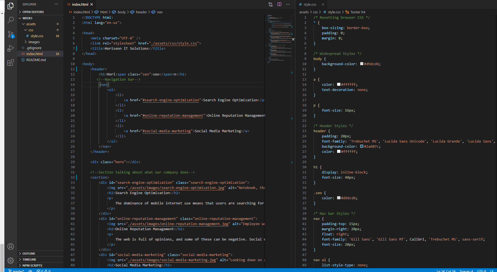

# accessibility

## Description

In this project I helped Horiseon make their website more accessible to their customers and viewers.  I started by fixing broken links and giving the webpage a concise and descriptive title.  Next I worked on coverting div tags to more specific tags like header, section, aside, and footer, as well as, changed the h2 tag in the footer to an h4 because the footer has less importance than the main section headers.  I also deleted a couple of class elements because they were unneeded now that the div tags were more specific.  After that I went to the styles.css and started working to make it look and work better.  In both the css and html, I added comments to decipher each section of the code to make it easier for another developer to read in the future.  I combined a bunch of css statements together because there was a couple of statements that did the same thing (ie. multiple h2 statements that sized the font in the section).Finally I added alt tags to the images and gave the ones that needed a descriptive alt tag so that if the image didn't show they would know what was happening.  If you would like to see the finished webpage you can go to (https://duncanmarten.github.io/accessibility/).
